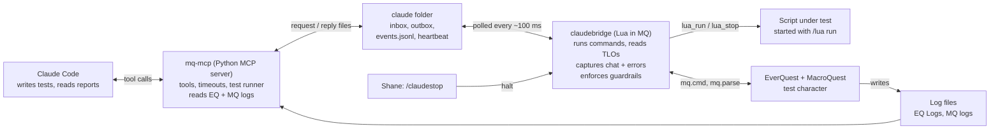
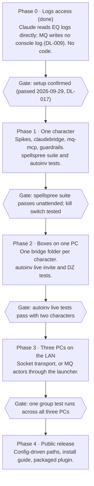

# MQ Claude Test Bridge — Design Spec

Sep 29, 2026 · Shane

## Overview

Claude runs MacroQuest Lua tests end to end with no manual steps. It reloads a script in game, drives the character, reads TLOs and logs, and decides pass or fail. Shane only steps in to review results or take over with the kill switch.

**Goals**

- Remove the manual reload → play → read logs → paste loop for Lua development.
- Give Claude real control of one test character through MacroQuest commands, with results checked through TLOs rather than screenshots.
- Make tests repeatable: a test is a file that can be run again after every code change.
- Have Claude design its own unhappy-path tests and report what breaks, instead of only testing the happy path.
- Keep hard guardrails in code, not only in Claude's instructions.

**In scope for v1:** one character, one PC, Lua scripts only, Project Triune (RoF2 emulator, automation explicitly allowed).

**Non-goals for v1:** C++ plugin builds, multi-character or multi-PC tests, visual or timing judgment ("does it look smooth"), and any use on live Daybreak servers.

## Environment

Everything runs on one Windows PC. Paths marked "assumed" follow MacroQuest defaults and are confirmed during setup. Paths marked "confirmed" were checked directly on this machine during Phase 0 (2026-09-29).

| Item | Value |
| --- | --- |
| MacroQuest build | Latest emu-rof2 release from [macroquest/macroquest](https://github.com/macroquest/macroquest/releases) |
| MacroQuest root | `C:\Users\Public\MacroQuest` |
| Lua scripts | `C:\Users\Public\MacroQuest\lua` (confirmed; contains `autoinv.lua` and `spellspree.lua`) |
| MacroQuest logs | `C:\Users\Public\MacroQuest\Logs` (confirmed; the folder is named `Logs` with a capital L; Windows ignores case, so `logs` also resolves) |
| EverQuest client | `C:\Users\Public\Project Triune` (RoF2 emulator) |
| EverQuest logs | `C:\Users\Public\Project Triune\Logs` (confirmed; enabled with `/log on`; files are named `eqlog_<Character>_<server>.txt`, and were readable while the game was running) |
| Python | 3.14.7, for the MCP server (confirmed 2026-09-29, 64-bit, DL-015) |
| Plugins | 101 in the plugins folder; v1 needs MQ2Lua, and MQ2Nav with meshes for movement tests |
| Claude access | Claude Code on this PC, with access to the MacroQuest and Project Triune folders |

The bridge only uses core MacroQuest features and MQ2Nav, so the other plugins don't matter for v1.

**What the log folders contain (Phase 0 findings).**

- The MacroQuest `Logs` folder holds MacroQuest's own internal and launcher logs (`MacroQuest-<timestamp>.log`, `MacroQuest-Launcher-*.log`, `MQ2Nav.log`). No file there was found that records MQ console output or Lua `print()` output. A review of the MacroQuest documentation (2026-09-29, see DL-007) found no documented setting that writes console or chat output to a file. `/mqlog <text>` writes only the text it is given, to `MacroQuest.log` in the `Logs` directory, and `/mqconsole` documents no logging. The docs say only that Lua `print()` is "redirected to write to the mq chat"; they do not say whether that reaches a file. A read of the MacroQuest source (2026-09-29, see DL-008) shows `print()` output goes to MQ chat only, with no file write on that path, and that every running Lua script's `mq.event` matchers are fed that chat line. This is from source, not yet confirmed live, and the source's changelog matches the installed build's (newest entry 6/23/2026), so the versions probably match but are not proven. This bears on the first spike under Risks and spikes.
- Scripts that log do so to their own files, and location varies by script: PTAR and PTDeathRecovery write under `Logs\`, while autoinv writes to `config\AutoInvite\autoinvite.log`. The autoinv path comes from the script's description and has not been checked on disk. `log_tail` and `log_search` therefore need a configurable list of log locations, not a single folder.
- Log files can be very large (an EverQuest log of about 60 MB and a launcher log of about 231 MB were present), so `log_tail` and `log_search` read from the end of a file or stream it, rather than loading it whole.

## Architecture



Claude never touches the game directly. Every action goes through the MCP server and the shared folder to the bridge, which applies the guardrails before anything reaches EverQuest. Logs are read straight from disk.

## MQ-side bridge (Lua)

The bridge is a Lua script, `claudebridge`, started once per session with `/lua run claudebridge`. It is the only thing that touches the game: it runs commands, reads TLOs, captures chat, and enforces the guardrails.

**Transport: files, not sockets.** v1 talks through a folder, `C:\Users\Public\MacroQuest\claude\`, so it needs no extra Lua packages. Sockets come later for multi-PC (see Roadmap).

- The MCP server writes each request as `inbox\<seq>.json`, writing to a temp name first and renaming so the bridge never reads half a file.
- The bridge checks for the next sequence number every ~100 ms and writes the reply as `outbox\<seq>.json`.
- The bridge appends everything it observes to `events.jsonl`: chat lines, script start and exit, errors, and guardrail blocks.
- The bridge writes `heartbeat.json` every second with the character name, zone and bridge state, so the MCP server can tell if the game or bridge has died.
- JSON uses a vendored pure-Lua library (for example rxi/json.lua) shipped with the bridge.

**Command set**

| Command | What it does | Notes |
| --- | --- | --- |
| `ping` | Returns bridge version, character, zone, and state | Health check |
| `cmd` | Runs one slash command with `mq.cmd` | Checked against the running test's allowlist first |
| `eval` | Evaluates a TLO expression with `mq.parse` and returns the string | Read-only; e.g. `${Me.PctHPs}`, `${Target.CleanName}` |
| `eval_many` | Evaluates a list of expressions in one round trip | Snapshots for assertions |
| `wait_for` | Polls an expression inside the game until it matches or times out | Avoids a Claude round trip per poll; e.g. wait until `${Navigation.Active}` is FALSE |
| `lua_run` | Starts a script with `/lua run` | Returns the PID. Does nothing if the script is already running, so a reload stops it first (DL-011) |
| `lua_stop` | Stops a script by name or PID | |
| `lua_status` | Reads `${Lua.Script[name].Status}` (`RUNNING`, `PAUSED`, `EXITED`) and related members | `Status` cannot tell a crash from a stop; crashes come from the error text (DL-011, DL-014) |
| `chat_since` | Returns captured chat lines after a cursor | From a catch-all `mq.event` |
| `halt` | Kill switch: stops the script under test, movement, and combat, then refuses new commands | Same as the in-game `/claudestop` |

**Error capture.** A Lua error is printed to MQ chat as one line holding the message, `stack traceback:` and the frames, with the line breaks removed. The bridge's catch-all event hears it and writes it to `events.jsonl` with file, line and stack. This covers a crash in the main chunk and in `mq.event` and `mq.bind` handlers, with no wrapper around the script under test (DL-013, DL-014). A crash in a handler does not stop the script or change its `Status`, so the error text is the only signal for it. A crash in the main chunk is followed by `Ending lua script ... status -1` with no `Ending running lua script ...` line before it; a manual stop prints that line. That pattern is observed, not documented. Scripts can also opt in to a tiny `testlog` module that writes structured lines (`decision`, `state`, `error`) to the same file. *(Supersedes the earlier design of an error-capturing `claudebridge/runner`; see DL-014.)*

## MCP server (Python)

The MCP server, `mq-mcp`, is a small Python program on the PC that turns bridge commands into tools Claude can call. It runs over stdio, is started by Claude Code from the project's `.mcp.json`, and uses the official `mcp` Python SDK. It adds timeouts, retries, and readable errors, so Claude never deals with raw files.

| Tool | Purpose |
| --- | --- |
| `mq_status` | Is the game running, is the bridge alive, who and where is the character |
| `mq_command` | Send one slash command; returns whether it was allowed and any chat it produced |
| `mq_eval` | Read one or many TLO expressions |
| `mq_wait_for` | Wait for a condition in game, with a timeout |
| `lua_reload` | Stop and restart a script |
| `lua_status` | Running, paused or exited, plus any crash seen in the error text, with its file, line and stack (DL-014) |
| `mq_events` | Chat, errors and script output since a cursor, filterable by type or pattern |
| `log_tail` / `log_search` | Read or grep the EverQuest and MacroQuest log files without copying them |
| `run_test` | Run a test file end to end and return a pass or fail report (see next section) |
| `mq_halt` | Kill switch from Claude's side |

**Configuration** lives in one `config.toml`: folder paths, the character name, poll interval, and default timeouts. Nothing is hard-coded, which keeps the path open to a public release.

**Packaging.** The MCP server, the bridge files, and a skill describing the test loop live in one Claude Code project, and can later be packaged as a plugin. The skill tells Claude how to work: run the testability check, write and run tests, read the reports, and hand Shane a findings list. When Shane asks for fixes, Claude edits, reloads and reruns until green or a retry limit is hit.

## Test definitions and runner

Each test is a TOML file next to the script it tests, so a test written once can be rerun after every change. TOML is read by Python's built-in `tomllib`, so there are no extra dependencies. Claude writes these files; Shane reviews them.

A test has four parts, run in order:

1. **Preconditions**: TLO checks that must hold before starting, such as zone, level, or platinum. A failed precondition means "can't test", not "failed".
2. **Setup**: commands to get into position, such as `/nav` to a spot or clearing the target.
3. **Steps**: run the script, send commands, and wait for conditions, each with a timeout.
4. **Assertions and teardown**: TLO values, event and log patterns that must or must not appear, then stop the script and return to a known state.

```toml
# Uses the proposed /spellspree command hooks (see First test targets).
name = "spellspree: Cleric 1-25 buys and scribes everything"
script = "spellspree"
timeout_s = 900
allow = ["/lua run spellspree", "/lua stop spellspree", "/spellspree *"]

[[pre]]
expr = "${Zone.ShortName}"
equals = "poknowledge"

[[pre]]
expr = "${Navigation.MeshLoaded}"
equals = "TRUE"

[[pre]]
expr = "${Cursor}"
equals = "NULL"

[[step]]
lua_run = "spellspree"

[[step]]
cmd = "/spellspree select Cleric 1-25"

[[step]]
cmd = "/spellspree run"

[[step]]
wait_for_event = "Shopping spree: all 1 vendor(s) done."
timeout_s = 840

[[assert]]
events_absent = "Unexpected error"

[[assert]]
events_present = "Purchased \\(%d+\\):"

[[assert]]
expr = "${Cursor}"
equals = "NULL"
```

**Reports.** Each run writes a JSON report and a short Markdown summary to `claude\reports\`: every step with timing, each assertion with expected and actual values, the captured events, and the first error. Claude turns failed tests into findings. Shane can read the summary to see what happened without watching.

## Testability check

Before writing any tests for an existing script, Claude checks what it needs to drive and observe that script. It then asks permission before adding anything.

1. **Check.** Claude reads the script and answers four questions:
   - Can every action be started without clicking ImGui?
   - Can its state and results be read without parsing chat?
   - Can it run without costly or irreversible side effects?
   - Does anything wait on the user, such as mouse position or confirmation windows?
2. **Propose.** For each gap, Claude proposes the smallest hook that closes it, such as a slash command, a status file, a dry-run flag, or a headless flag. Each proposal says what it adds, where it goes, and that normal use is unchanged.
3. **Ask.** Claude sends Shane the proposal and waits. Nothing is added to the script without approval, and Claude doesn't fix bugs while adding hooks.
4. **Build and test.** Only approved hooks are added. Tests that depend on a declined hook are marked as not runnable, with the reason.

The spellspree and autoinv sections below show what this check produces.

## Unhappy-path testing

Shane provides the scripts; Claude designs the tests, and most of them target unhappy paths. Happy-path tests only prove the basics work. The value is in the failures Claude finds on its own.

**How Claude finds the unhappy paths**

1. Read the script for every way it can fail or be misused: each early return, stop reason, timeout, retry, fallback, and command argument.
2. Read what the script says it does (header, command help, comments) and treat each claim as something to try to break.
3. Apply a standard checklist to every script:
   - closing or hiding its window mid-run
   - commands with missing, wrong or odd arguments
   - timeouts, and slow or missing game responses
   - empty, partial or malformed files it reads
   - repeated or spammed input
   - stopping, restarting or zoning mid-run
   - running out of a resource (money, bag space, spellbook space)
4. Write each case as a test file, run it, and keep it in the suite as a regression test.

Tests can set up bad conditions with fixture steps, for example `write_file` to empty or corrupt a file the script reads.

**Worked example: autoinv.** These unhappy-path tests each fail on the current code.

| Test | Expected | What the current code does |
| --- | --- | --- |
| Close the window with `/autoinv`, then inject an `inv` tell | `INVITE` in the log | The script has exited, and `/autoinv` no longer exists |
| Empty the guild dump during a refresh, with a good roster loaded | Roster keeps its members; refresh reports failure | Roster replaced with 0 members and reported as success |
| Inject 10 `inv` tells from one unknown name | At most one reply tell in the EQ log | Ten reply tells |
| `/autoinv invite` with no argument | Setting unchanged, or toggled with a message | Auto-invite silently turned off |
| Load with auto-refresh on | One "roster refresh start" line | Two |

**Findings.** Each failed test becomes a finding with a severity (bug, gap, or minor), the evidence (log lines and TLO values), and a suggested fix. Claude reports findings; it changes code only when Shane asks.

## Safety and guardrails

Claude can only run commands a test explicitly needs, and can only send chat when the test requires it. The bridge enforces this in Lua, so a bad instruction or a bug can't get around it.

| Guardrail | How it works |
| --- | --- |
| Per-test command allowlist | Each test file lists the exact commands it needs (`allow`). While that test runs, the bridge refuses everything else. Outside a test run, only read-only requests work |
| Chat only when required | A chat command is allowed only if the test lists it with its target, for example `/tell Testalt`. There is no general chat permission |
| Allowlist shown up front | When Claude proposes tests, it shows each test's allowlist |
| Kill switch | `/claudestop` in game (an `mq.bind`) stops the script under test, stops movement and combat, and puts the bridge in refuse-all mode until `/claudestart` |
| Watchdog | If the MCP server stops writing for a set time (default 5 min), the bridge halts as if `/claudestop` were used |
| Audit log | Every command, allowed or refused, is written to `claude\audit.log` with a timestamp and the running test's name |
| Read-only by default | `eval`, `chat_since` and status reads never change game state |

Allowlist entries are checked after `${...}` expansion and can use wildcards for arguments, such as `/nav id *`.

Commands a script under test sends itself, like autoinv's reply tells, don't pass through the bridge. Tests that could trigger them must use settings or fake names that keep them harmless, and the test proposal says so.

## First test targets

spellspree can be tested fully with one character, so it goes first. autoinv already has a command interface; most of its tests run with one character because fake tells can be injected (spike 5, DL-016), and the rest wait for a second character in Phase 2.

### spellspree

**What it does (v1.3).** It detects the character's classes from the Inventory window: up to three on Project Triune's trio setup, falling back to `Me.Class`. The player ticks class and tier boxes (1-25, 26-50, 51-60, 61-70) in its ImGui window, and each box maps to one named PoK vendor. "Run Shopping Spree" then handles each selected vendor in turn:

1. Navigates with MQ2Nav, then targets and opens the merchant.
2. Checks that the "usable items only" filter is on.
3. Walks the visible list, buying and scribing every `Spell:` scroll. Each step is confirmed by TLO reads: money moved, item landed, scroll left the slot.
4. Closes and reopens the merchant between passes until a full pass buys nothing.

It stops on a missing mesh, NPC not found, a nav timeout, a merchant that won't open, out of money (configurable), full inventory, an item on the cursor, or a failed scribe.

**Facts that shape the tests**

- **No command interface.** Vendor selection and Start exist only as ImGui checkboxes and buttons.
- **Scribing is permanent.** Once a tier is scribed, the usable-only filter hides those spells, so a rerun buys nothing. A full buy test uses up a character's unscribed spells and platinum.
- **Test characters.** Fresh level 1 characters, set up the way Shane normally does: get the 2nd and 3rd classes, give them platinum, move to PoK. Level 1 characters can scribe spells above their level on Project Triune.
- **Mouse-over pause.** If the mouse is over its window, the script pauses for up to 60 s before each click. An unattended run has to keep the cursor clear.
- **Useful log lines.** Every line goes through `print()` with a `[SpellSpree]` prefix, and the summary lines are fixed text ("Shopping spree: all N vendor(s) done.", "Purchased (N): …", "Skipped (N): …"). These make good assertions once the bridge can see them.
- **Evidence for the output spike.** Its own notes say `mq.event` never fired for "You give…" or scribe lines, but does fire for vendor price tells.

| Test | Setup | Pass when |
| --- | --- | --- |
| Class detection | Load the script | "Detected class(es)" matches the character's classes |
| Vendor navigation | One tier selected | Character within a set distance of the vendor, `${Window[MerchantWnd].Open}` TRUE, no nav timeout |
| Usable filter | Merchant open | `MW_UsableButton` checked; no "not confirmed" stop |
| Buy and scribe | Fresh character, enough platinum | Every name under "Purchased" is in `${Me.Book[...]}`, no scrolls left in bags, cursor empty |
| Full new-character run | Fresh three-class character, all tiers for all three classes | Every vendor visited, totals add up, state Done |
| Convergence | Same run | Last pass buys zero, merchant closes, state Done |
| Rerun is a no-op | Same tier again | "Purchased (0)" and no platinum spent |
| Money accounting | Same run | Platinum drop equals the logged Spent total |
| Out of money, stop on | Little coin, option on | Stops with an out-of-money reason, spree ends, cursor empty |
| Out of money, skip | Little coin, option off | Unaffordable spells listed under Skipped; run finishes |
| Full bags | No free slots | Stops before buying with "Inventory full" |
| Stop and kill switch | Mid-run | Nav stops, state Stopped, cursor empty |

**Example testability check: what Claude would propose and ask about when testing starts.** None of these change normal use.

1. **Command binding.** For example `/spellspree select Cleric 1-25`, `/spellspree clear`, `/spellspree stoponmoney off`, `/spellspree run` and `/spellspree stop`, setting the same state the checkboxes do.
2. **Status output.** Write the state, last stop reason, and bought, skipped and spent counts to a small status file or answer `/spellspree status`, so tests don't depend on parsing log text.
3. **Dry-run flag.** Do everything except click Buy, and log what would be bought. Navigation, filter and list-scan tests can then repeat without spending platinum or spells.
4. **Headless flag.** Skip the mouse-over wait when started by the bridge.

### autoinv

**What it does.** It is a Lua refactor of `autoinv.mac`. A tell whose whole body is the invite trigger (default `inv`) sends `/invite`, and one matching the DZ trigger (default `dzadd`) sends `/dzadd`. "<name> has left the group." sends `/dzremoveplayer`. Gating is one switch:

- **Guild-only on (default):** the sender must be on the guild roster or the extras whitelist.
- **Guild-only off:** anyone is allowed.

The roster comes from `/outputfile guild`, parsed from the file EverQuest writes. If the roster is empty, the script falls back to the in-zone guild TLO. There is no group-only or whitelist-only mode; the code is authoritative over earlier descriptions.

**Facts that shape the tests**

- **Already scriptable.** `/autoinv` covers every setting, plus `refresh`, `roster` and `status`.
- **Already logs structured lines.** `INVITE`, `DENY`, `DZADD`, `DZREMOVE`, roster parse and `STATUS` lines go to `config\AutoInvite\autoinvite.log`, which is reset on each load. These are ready-made assertion targets.
- **Replies by itself.** When whisper-deny is on, the script sends `/tell`s to denied senders, and it sends `/g` announcements. These don't go through the bridge, so tests should use fake sender names or turn whisper-deny off.
- **Tell to self doesn't help.** It only prints "Talking to yourself again?", not a "tells you" line.
- **Spike: can a fake tell be injected?** **Resolved live 2026-09-29 (DL-016): yes.** An `/echo` of "Spikefive tells you, 'inv'", typed-style or sent from a script with `mq.cmd`, fired an `mq.event` using autoinv's own pattern with the sender and body captured correctly, so the whole tell path can be tested with one character. The resulting `/invite` to a name that isn't online is expected to be harmless; that has not been tested with autoinv running. Not shown: that a real tell from another player produces the identical text, which Phase 2 covers.

| Test | Phase | Pass when |
| --- | --- | --- |
| Roster refresh | 1 | After `/autoinv refresh`, the log shows a parse with more than 0 members and known guildmates are listed by `/autoinv roster` |
| Gate: guild member | 1 | Injected `inv` from a guildmate's name gives `INVITE <name> (guild)` |
| Gate: extras | 1 | After `/autoinv add Outsider`, an injected `inv` gives `INVITE Outsider (extras)` |
| Gate: denied | 1 | An unknown name gives `DENY invite` and no `/invite` in the audit log |
| Guild-only off | 1 | Any name gives `INVITE` |
| Trigger matching | 1 | `INV`, ` inv ` are accepted; `inv please` and `invite` are ignored |
| Group full | 2 | With 5 others grouped, `DENY invite (group full)` |
| Live invite | 2 | A second character's real tell produces a pending invite and `${Group.Member[<name>]}` after accepting |
| Live DZ add and remove | 2 | With an expedition open, the sender is added; after leaving the group, they are removed |

**Testability check result:** none are required. A `/autoinv selftest` subcommand that runs the gate against sample names would make the Phase 1 tests independent of fake-tell injection.

## Roadmap



Phase 0 needed nothing built and is done (DL-017). The file transport from Phase 1 carries through Phase 2 unchanged; only Phase 3 needs a network transport.

## Risks and spikes

A documentation and source review came first and is closed (DL-007, DL-008): MacroQuest writes no log of console or `print()` output, so the bridge's Lua must capture whatever Claude needs to read (DL-009). Five short spikes at the start of Phase 1 settle the remaining unknowns before anything else is built.

| Spike | Why it matters | Fallback |
| --- | --- | --- |
| Does a catch-all `mq.event` see `print()` output from other Lua scripts, or only EverQuest chat? **Resolved live 2026-09-29 (DL-010): it sees it.** | Decides how script output reaches Claude | `testlog` writes to `events.jsonl` directly (not needed for this purpose) |
| Exact values of `${Lua.Script[name].Status}` on this build. **Resolved live 2026-09-29 (DL-011): `RUNNING`, `PAUSED`, `EXITED`; no error value, and a crash reads as `EXITED`, the same as a stop.** | Test steps wait on them | Poll `/lua ps` output instead (not needed for status; crash detection is open, see DL-011) |
| Can the runner wrap a script's main loop in `pcall` without changing its behavior? **Resolved live 2026-09-29 (DL-012): yes, via `loadfile` + `xpcall` (not `require`). Delays, events, return values and `/lua stop` behave the same, but a caught crash then looks like a clean exit to MacroQuest, so the runner must report it.** | Needed for tracebacks | Read errors from the MQ console log (that text is chat, not a file; the bridge can hear it, see DL-010). **Decided 2026-09-29 (DL-014): the runner is left out of v1; crashes are detected from the error text (DL-013).** |
| Does the `mcp` Python SDK install cleanly on Python 3.14? **Resolved 2026-09-29 (DL-015): yes. `mcp` 2.2.0 installed and a stdio server/client round trip worked. In 2.x `FastMCP` is renamed `MCPServer`.** | The MCP server depends on it | Use a separate Python 3.12 or 3.13 install for the server (not needed) |
| Can `/echo` of a fake tell fire `mq.event`? **Resolved live 2026-09-29 (DL-016): yes.** | Single-character autoinv tests | Move tell tests to Phase 2 (not needed) |

**Other risks**

- **Claude is slow in real time.** Each tool call takes seconds, so tests should wait inside the bridge (`wait_for`) rather than poll from Claude.
- **The world isn't reset between runs.** Platinum, bags, and spellbook change after a spellspree test. Tests need preconditions and teardown; fresh characters cover buy tests.
- **MQ2Nav meshes.** Navigation tests depend on a current Plane of Knowledge mesh.

## Decisions made

- **Test characters:** fresh level 1 characters set up with 2nd and 3rd classes, platinum, and moved to PoK.
- **Tell to self:** prints "Talking to yourself again?"; can't drive autoinv tests.
- **autoinv approval modes:** the code is authoritative (guild plus whitelist, or anyone).
- **Chat and commands:** Claude may only run commands, including chat, that a test explicitly requires.
- **Script changes:** Claude never fixes bugs unprompted. It proposes testability hooks and asks before adding them.

## Sources

- [MacroQuest releases](https://github.com/macroquest/macroquest/releases)
- [Lua scripting in MacroQuest](https://docs.macroquest.org/lua/)
- [Lua actors](https://docs.macroquest.org/lua/actors/)
- [Lua events and binds](https://docs.macroquest.org/lua/events-and-binds/)
